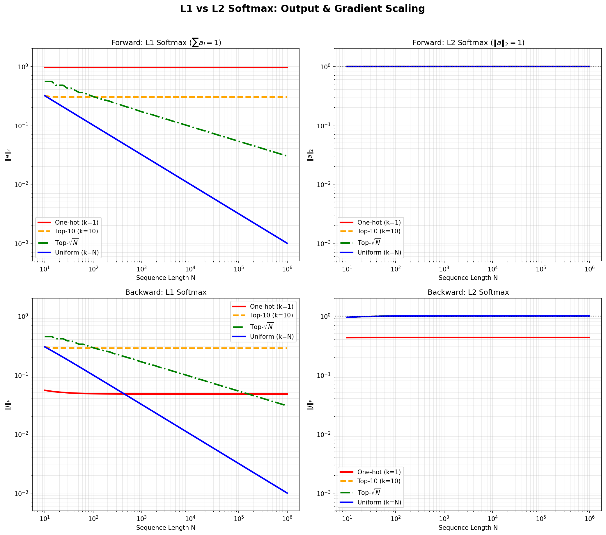
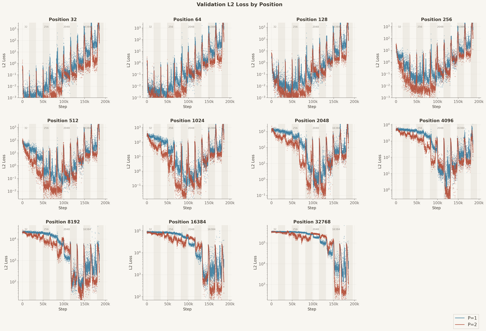

+++
title = "Attention Normalizes the Wrong Norm"
date = 2025-12-23
draft = false
description = "Softmax constrains the L1 norm to 1, but should constrain the L2 norm."
tags = []
+++

We treat attention as a solved primitive. You can fuse kernels, tile memory access, quantize weights, but the formula
itself is finished.

It isn't.

Softmax normalizes the L1 norm to 1. Variance preservation requires the L2 norm to equal 1. These constraints differ.
The mismatch causes attention output variance to collapse as sequence length grows, forcing models to learn
position-dependent compensation. That compensation doesn't transfer to unseen lengths.

The fix is changing one norm.

## The Math

Attention computes $\sum_i A_i V_i$. If the $V_i$ have unit variance and are uncorrelated:

$$\text{Var}\left(\sum_i A_i V_i\right) = \sum_i A_i^2 = \|A\|_2^2$$

Softmax constrains $\|A\|_1 = 1$, not $\|A\|_2$. For uniform attention over $N$ tokens, $\|A\|_2 = 1/\sqrt{N}$.\
Variance collapses as context grows.



With L1 softmax, output magnitude depends on both sparsity and sequence length. With L2 softmax, it doesn't. The same
holds for gradients.

## The Evidence

Two identical models, differing only in softmax norm, trained to count occurrences of a target token. Training uses
staged sequence length (up to 2048), evaluation up to 32768.



L1 collapses beyond the current training length, while L2 generalizes up and down.

## The Fix

**p-softmax** generalizes softmax by normalizing to different Lp norms:

```python
def p_softmax(x, p=1.0, dim=-1):
    x = torch.exp(x)
    return x / x.norm(p=p, dim=dim, keepdim=True)
```

Standard softmax is p=1, variance-preserving softmax is p=2.

## Prior Work

Others have noticed attention scaling breaks at long contexts. Scalable
Softmax ([arXiv:2501.19399](https://arxiv.org/abs/2501.19399)) multiplies logits by $\log N$, a correction factor
discovered by making it learnable and observing what the model converged to.

It works. But $\log N$ is a fixed correction for an average-case attention pattern. Sharp attention needs no correction.
Diffuse attention needs more. SSMax can't tell the difference.

L2 normalization adapts automatically.

---

Code: https://github.com/ClashLuke/clashluke.github.io/tree/main/content/posts/attention_norm/code