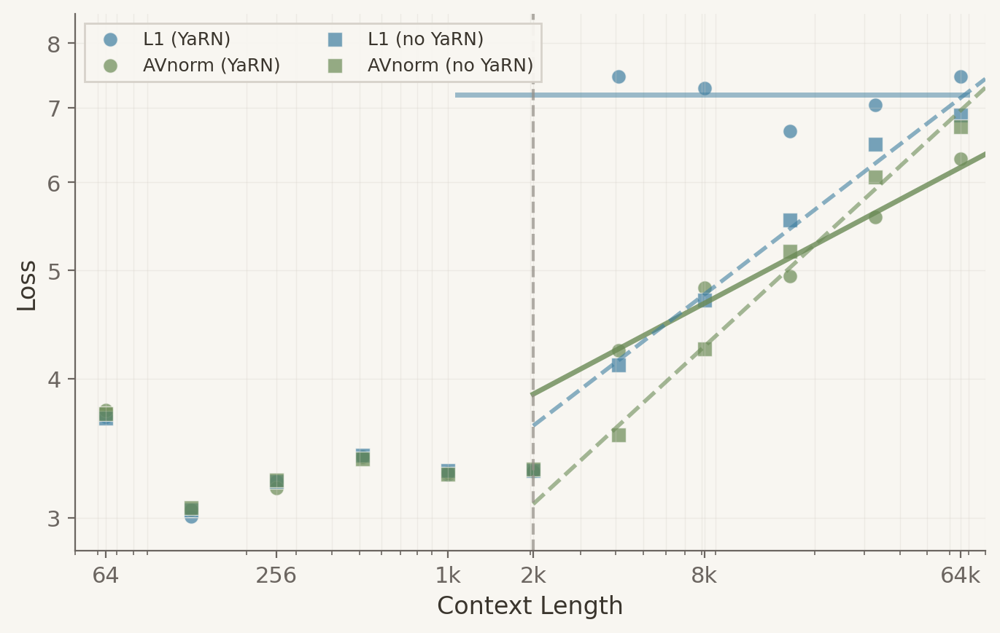
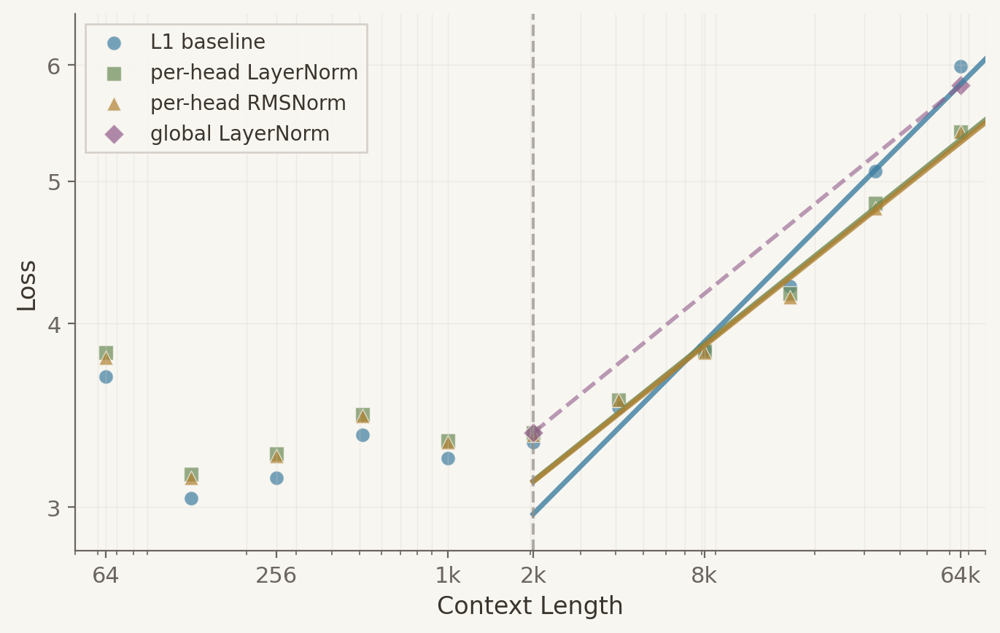
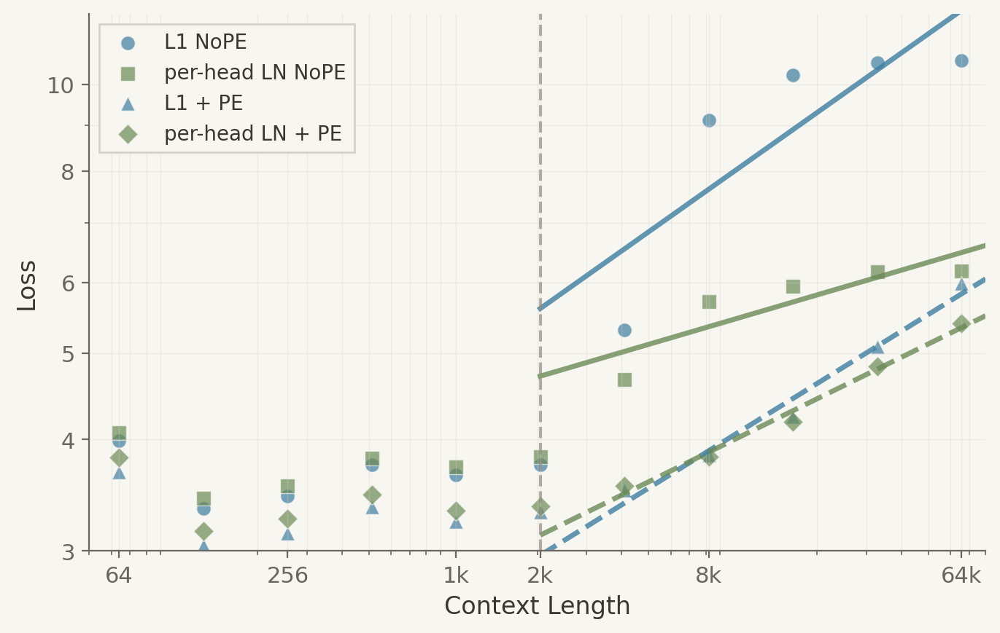

+++
title = "AVnorm"
date = 2026-01-10
draft = false
description = "Per-head normalization on attention outputs fixes length generalization."
tags = []
+++

["Attention normalizes the wrong norm"](https://convergentthinking.sh/posts/attention-normalizes-the-wrong-norm/) showed
that attention output variance collapses as context grows. L2-normalized softmax fixes it in theory, but existing
architectures are tuned for L1. So, swapping the norm breaks hyperparameters.

There's a simpler fix: normalize the output.

```python
av = attn @ v  # or F.scaled_dot_product_attention(...)
av = GroupNorm(num_groups=heads, num_channels=dim, affine=False)(av)  # per-head LayerNorm
```

AVNorm works with existing architectures without retuning components by normalizing each head's output independently.

## Evidence

Two [nanogpt](https://github.com/KellerJordan/modded-nanogpt/commit/13badcf9bfea7518a51a0375211f8a54d8fbde6c) models
trained on FineWeb-Edu for 4000 steps:

At training length, AVnorm matches the baseline, but beyond training length, the gap widens. At 2x context,
the baseline's loss jumps from 3.3 to 7.5 while AVnorm only increases to 4.2.



When extrapolating, the baseline model fails abruptly, while AVnorm degrades smoothly.

## Retrofitting

L2 Softmax made one key mistake: requiring retraining and retuning. AVNorm reuses existing hyperparameters.

Let's push further: instead of just hyperparameters, reuse the model itself. Earlier experiments trained from
scratch. This time, pretrain for 3000 steps, finetune for 1000, and compare L1 continuation versus adding AVnorm.


By 500 steps, AVNorm matches the L1 baseline.

## Understanding AVnorm

Softmax normalizes L1 (weights sum to one), but variance depends on L2 (sum of squares). As context grows, variance
collapses *assuming independent inputs*. AVnorm sidesteps this assumption by normalizing outputs instead.

A per-head normalization achieves what L2 softmax aimed to achieve: constant variance per head regardless of attention
pattern and context. If this holds, per-head RMSNorm should perform similarly to per-head LayerNorm. However,
global normalization should underperform per-head variants, as one head's attention pattern affects another's scale.

To test this, the same pretrained L1 checkpoint is finetuned with different normalizations.



In practice, per-head RMSNorm and per-head LayerNorm are indistinguishable (both 5.4 at 65K), while global LayerNorm has
no advantage over unnormalized attention.

Removing position embeddings tests whether variance is the bottleneck. Without PE, unnormalized attention collapses
at long context while per-head LayerNorm stays close to the baseline with PE. The causal mask implicitly encodes
position; normalization reveals it.



---

[Code](https://github.com/ClashLuke/clashluke.github.io/tree/main/content/posts/avnorm/code)
