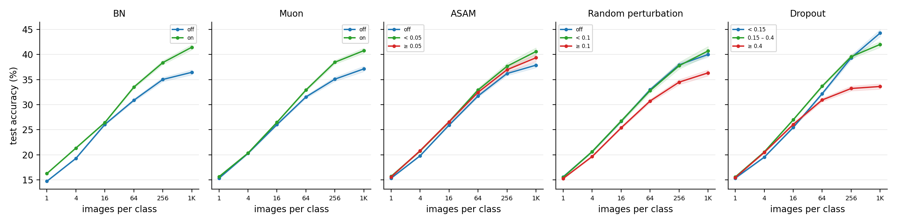
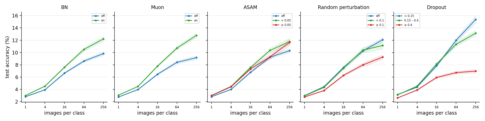

+++
title = "Steer Before You Shrink"
date = 2026-03-08
draft = true
description = "Training methods that steer optimization scale. Methods that restrict the network don't."
tags = ["ml", "research"]
+++

What separates training methods that scale from those that don't?

Across 61,000 configurations on CIFAR, batch normalization, orthogonalized updates, and ASAM help at every data
scale with no sign of diminishing returns. Dropout and random weight perturbation are neutral to mildly helpful
only at low strength, and the threshold drops as task complexity rises.

BN [orthogonalizes representations](https://arxiv.org/abs/2106.03970), and Muon orthogonalizes parameter
updates. Both [steer the optimization](https://arxiv.org/abs/1805.11604) without restricting what the network
can learn. In the tested range, their effect does not reverse, and it grows with task complexity.

Dropout restricts the network during training. At low rates, the restriction is cheap. At high rates, the cost
scales with task complexity.

The same pattern holds on CIFAR-100, where dropout is at best neutral at the lowest tested scales and negative
after that. Methods that steer do not reverse in the tested range. Methods that shrink do, and the reversal
moves earlier as complexity rises.

Large-scale training [moved away from dropout](https://aclanthology.org/2025.findings-acl.111/), and this sweep
suggests why.

What separates methods that scale is whether they steer or shrink.

---

[Benchmark](https://github.com/ClashLuke/clashluke.github.io/tree/main/content/posts/generalization), 68K sampled configs, 61K completed.
