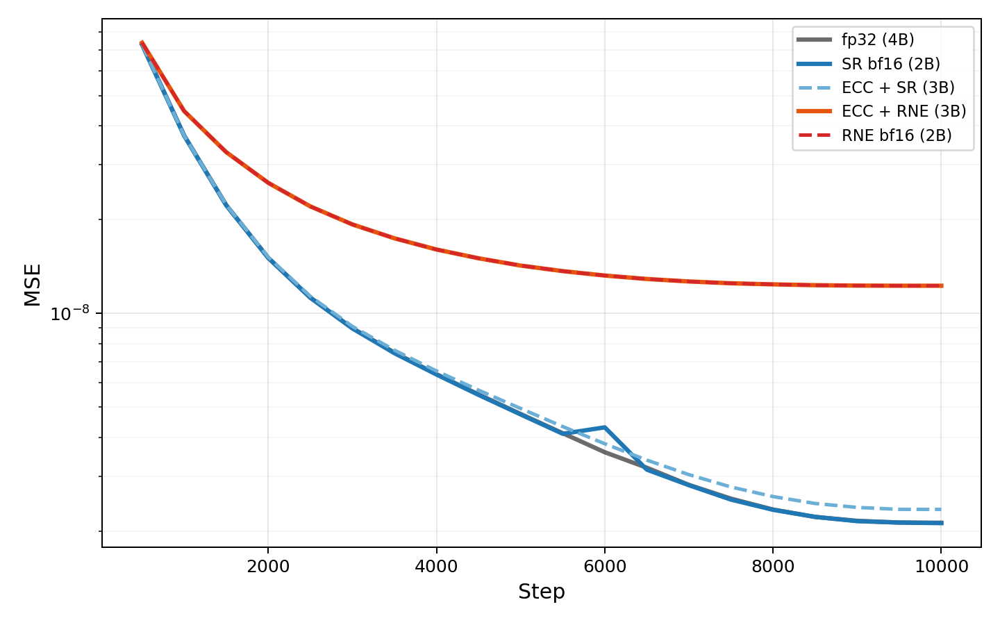

+++
title = "Bias Compounds, Variance Washes Out"
date = 2026-03-12
draft = false
description = "Fix the bias and two bytes match four."
tags = []
math = true
+++

Round-to-nearest makes the same rounding error every time it sees the same value. Stochastic rounding makes a
different error each time, centered on zero. When the same error repeats, it compounds. When errors are random and
centered, they cancel.

Add 0.001 to 1.0 a thousand times in BF16 and round-to-nearest never moves. Every update falls closer to 1.0 than
to the next representable value, so every update is absorbed. Stochastic rounding reaches 2.0, because each update
rounds up with a probability proportional to its size, and a thousand small chances add up.

Over $n$ steps, biased errors grow as $O(n)$, but unbiased errors grow as $O(\sqrt{n})$. The random jitter cancels out.

## The Experiment

The obvious fix for rounding error is more precision. [Error correction](https://arxiv.org/abs/2602.23349) stores a
bf16 value and an int8 residual, doubling the effective precision for 50% more storage. Training the same MLP with
[HeavyBall](https://github.com/HomebrewML/HeavyBall)'s AdamW, we can test both axes independently, varying only the
rounding and storage of the optimizer state, with parameters and computation in fp32.

Two clusters with nothing in between.\
The unbiased methods (SR bf16 at 2B, ECC + SR at 3B) track fp32, but the biased methods (RNE bf16 at 2B,
ECC + RNE at 3B) stagnate together. The extra byte of correction didn't move the biased methods.

Fix the bias and two bytes match four. Keep the bias and three bytes match two.

---

[Code](https://github.com/ClashLuke/clashluke.github.io/tree/main/content/posts/stochastic_rounding/)
