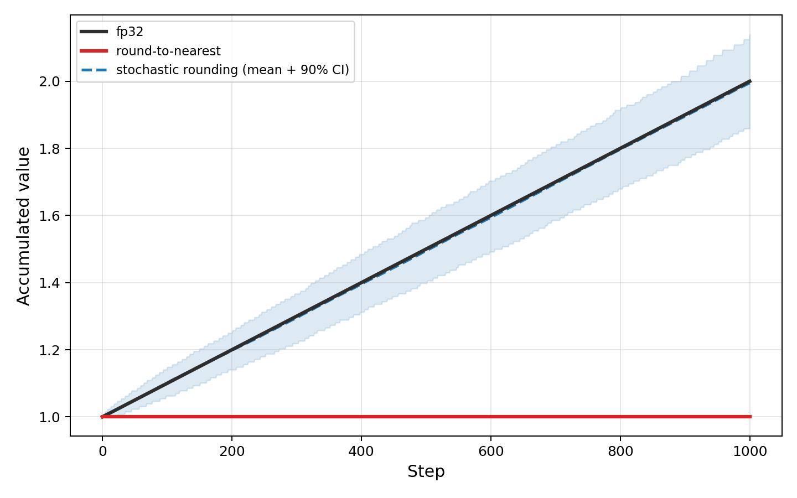
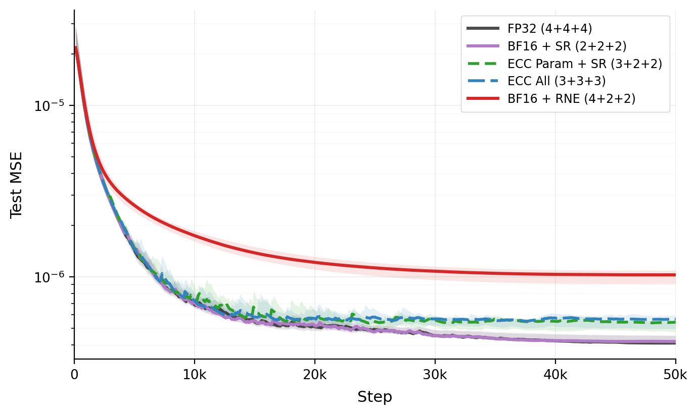

+++
title = "Bias Compounds, Variance Washes Out"
date = 2026-03-12
draft = false
description = "SR removes drift. ECC keeps the bits BF16 would lose."
tags = []
math = true
+++

Round-to-nearest makes the same rounding error every time it sees the same value. Stochastic rounding makes a
different error each time, centered on zero. When the same error repeats, it compounds. When errors are random and
zero-mean, they partly cancel.

Add 0.001 to 1.0 a thousand times in BF16 and round-to-nearest never moves. Every update falls closer to 1.0 than
to the next representable value, so every update rounds back to 1.0. Stochastic rounding reaches 2.0: each update
rounds up with probability proportional to its fractional position between representable values. In expectation, the
sum is exact.

Over $n$ steps, biased errors grow as $O(n)$, but unbiased errors grow as $O(\sqrt{n})$.

Variance does not disappear; it still accumulates, just more slowly than bias. Repeated bias accumulates linearly,
while repeated unbiased error diffuses like a random walk. Over long runs of tiny updates, the linear term dominates.

## The Experiment

The obvious fix for rounding error is more precision. [Error correction](https://arxiv.org/abs/2602.23349) stores a
bf16 value and an int8 residual, adding one extra byte per parameter to preserve low-order bits that plain BF16 would
drop. We train a small MLP on a teacher-student regression task using
[HeavyBall](https://github.com/ClashLuke/HeavyBall)'s AdamW and ECC implementation, varying the storage format for
parameters and optimizer state.

BF16 + SR (6 bytes for parameters, first moment, and second moment) nearly matches the fp32 baseline (12 bytes), and
both ECC variants close most of the gap to fp32. Plain BF16 + RNE (8 bytes) is worst: biased rounding in the optimizer
state accumulates error, and loss plateaus an
order of magnitude above the baseline despite fp32 parameters.

BF16 + SR adds no overhead, as stochastic rounding is fused into the optimizer kernel. ECC adds one byte of read/write
per parameter.

Substituting SR for ECC on the optimizer state reaches similar losses at 7 bytes per parameter versus 9. The only
difference is how the state is stored: ECC's residual byte with deterministic rounding versus plain bf16 with unbiased
rounding.

Fix the bias and six bytes nearly match twelve. Keep the bias, and eight bytes can't.

---

[Code](https://github.com/ClashLuke/clashluke.github.io/tree/main/content/posts/stochastic_rounding/)

Correction (2026-03-16): An earlier version used results affected by a torch.compile fusion that eliminated a bf16
round-trip, making ECC appear ineffective. The experiment has been rerun with corrected code. The BF16 + RNE baseline
uses a hand-written AdamW with fp32 parameters rather than HeavyBall, so its forward/backward passes run in fp32
while the other configs run in bf16, biasing the comparison in favor of RNE.

